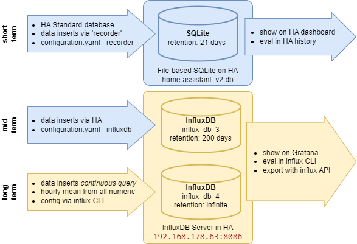

# HomeAssistant database concept


InfluxDB Reference: [YouTube: 2020 - InfluxDB – eine Einführung](https://www.youtube.com/watch?v=ccZuI7zvQMA)

## InfluxDB Server
The InfluxDB Server (V 1.8.10) runs on HomeAssistant at ``http://192.168.178.63:8086/``.

## Install InfluxDB for Windows
Binaries downloaded from https://portal.influxdata.com/downloads/ as admin.
That includes Server and Client while I'm just using the Client to connect to the Server from HomeAssistant.

## Start InfluxDB Client
```
PS C:\Program Files\InfluxData\influxdb\influxdb-1.8.10-1> .\influx.exe -host 192.168.178.63 -precision rfc3339 -username influx_user_1 -password ********

Connected to http://192.168.178.63:8086 version 1.8.10
InfluxDB shell version: 1.8.10

> show databases
name: databases
name
----
influx_db_1
influx_db_2
```

## Data exploration
[Explore data using InfluxQL](https://docs.influxdata.com/influxdb/v1.8/query_language/explore-data/)
### SELECT command
Example:
```
> SELECT value FROM kWh WHERE entity_id='walli_energy_total' AND TIME >= now() - 1d
name: kWh
time                        value
----                        -----
2023-04-28T18:40:00.29157Z  1313.133
2023-04-28T18:50:00.333715Z 1314.896
2023-04-28T19:00:00.322344Z 1316.664
2023-04-28T19:10:00.303324Z 1318.434
2023-04-28T19:20:00.322739Z 1320.207
2023-04-28T19:30:00.298399Z 1321.966
```
- get just the `value` data
- from the `kWh` measurement
- where the `entity_id` equals `walli_energy_total`
- from the last 10 days

```
> SELECT mean(value) FROM "°C" GROUP BY time(1d)
name: °C
time                 mean
----                 ----
2023-04-26T00:00:00Z 23.933333333333334
2023-04-27T00:00:00Z 23.734821428571422
2023-04-28T00:00:00Z 24.624999999999996
2023-04-29T00:00:00Z 26.23510638297872
```

### HELP command
```
> help
Usage:
        connect <host:port>   connects to another node specified by host:port
        auth                  prompts for username and password
        pretty                toggles pretty print for the json format
        chunked               turns on chunked responses from server
        chunk size <size>     sets the size of the chunked responses.  Set to 0 to reset to the default chunked size
        use <db_name>         sets current database
        format <format>       specifies the format of the server responses: json, csv, or column
        precision <format>    specifies the format of the timestamp: rfc3339, h, m, s, ms, u or ns
        consistency <level>   sets write consistency level: any, one, quorum, or all
        history               displays command history
        settings              outputs the current settings for the shell
        clear                 clears settings such as database or retention policy.  run 'clear' for help
        exit/quit/ctrl+d      quits the influx shell

        show databases        show database names
        show series           show series information
        show measurements     show measurement information
        show tag keys         show tag key information
        show field keys       show field key information

        A full list of influxql commands can be found at:
        https://docs.influxdata.com/influxdb/latest/query_language/spec/
```

## Downsampling 
References:
- [InfluxDB downsampling data](https://alex3305.github.io/home-assistant-docs/add-ons/influxdb-downsampling/)
- InfluxDB docu on Retention Policy: [Retention policy management](https://docs.influxdata.com/influxdb/v1.8/query_language/manage-database/#retention-policy-management)
- InfluxDB docu on Continuous Queries: [Automatically downsampling data into another retention policy](https://docs.influxdata.com/influxdb/v1.8/query_language/continuous_queries/#automatically-downsampling-data-into-another-retention-policy)

My solution: Create a `CONTINUOUS QUERY` named __hourly__ that computes the hourly mean of each numerical value from `influx_db_3` and stores is to `influx_db_4`: 
```
> CREATE CONTINUOUS QUERY hourly ON influx_db_3 BEGIN SELECT mean(*) INTO influx_db_4.autogen.:MEASUREMENT FROM /.*/ GROUP BY time(1h), * END
```


